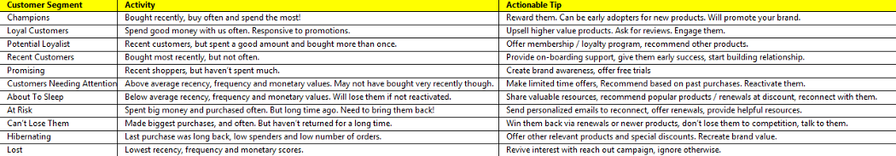

```{r setup, include=FALSE}
knitr::opts_chunk$set(echo = TRUE)
library("tidyverse")
library("dplyr")
library("tidyr")
library("stringr")
library("lubridate")
library("jsonlite")
library("readr")
library("maps")
library("ggplot2")
library("data.table")
library("haven")
library("readxl")
library('readr')

library(readxl)
marketing_datamart<- read_excel('Final_Datamart.xlsx',sheet = 'Sheet1',col_names = TRUE)


internet_gamblinginfo<- read_excel('internetgamblinginfo.xlsx', sheet ='Sheet1', col_names = TRUE)
```


---
```{r} options(width = 400)``
# This Analyses was conducted based on three major aspects that typically comprise of the KPIs for virtual gambling: 
1. Demographic Metrics
2. Revenue & Sales Metrics
3. Marketing Metrics: RFM Analysis

---

---

### Demographics Metrics

Based on the data, the top three populations that gambled included:
1. Germany (57.9%)
2. Turkey (5.78%)
3. Poland (5.74%)

Amoung these countries, the average age (regardless of gender) for gambling is 
```{r echo=FALSE} 
mean(marketing_datamart$AGE)
```

In reviewing the gender, most gamblers were found to be male given that, in the dataset sample, the population was 40,500 and the total population of men were
```{r echo=FALSE}
sum(marketing_datamart$GENDER=='Male')
```

This signifies a total population of 91% of online gamblers as male. Below is a graph of the gambling based on gender, but to learn more we direct you to our Shiny Application where you can review demogrpahics based on the age groups, languages and gender globally.
```{r echo=FALSE}
ggplot(marketing_datamart, aes( x = AGE ,y = sum(USERID) , fill = GENDER ) )+
    geom_bar(subset = (marketing_datamart$GENDER == "Female"),stat="identity") +
    geom_bar(subset = (marketing_datamart$GENDER == "Male"),stat="identity") +
    scale_y_continuous(breaks = seq(-3000, 3000, 1000), 
                     labels = paste0(as.character(c(3:0, 1:3)), "m")) + 
  coord_flip() + 
  scale_fill_brewer(palette = "Set1") + 
  theme_bw()
```

---

---

### Revenue & Sales Metrics

The Gross Gaming Revenue is similar to gross revenue as it shows the amount of money that stays with the casino as a result of players’ wagering activity, but prior to any expenses the casino must pay. The total Gross Gaming Revenue is taken by doing: Total_Bets - Total_Winning, which results in gross gaming revenue of:```r sum(marketing_datamart$Cumulative_Winnings) - sum(marketing_datamart$FOTotalStakes,marketing_datamart$LATotalStakes)```

The GGR is broken down based on two types of betting : Fixed Odds and Live Action.

#### 1. Fixed Odds: 
  * Fixed Odd Total Stakes: 
  ```{r echo=FALSE} 
  sum(marketing_datamart$FOTotalStakes)
  ```
  * Average Days Users were Active: 
  ```{r echo=FALSE} 
  mean(internet_gamblinginfo$FOTotalDaysActive, na.rm = TRUE)
  ```
  * Average Total Stakes: 
  ```{r echo=FALSE} 
  mean(internet_gamblinginfo$FOTotalStakes, na.rm = TRUE)
  ```
  * Average Number of Bets: 
  ```{r echo=FALSE} 
  mean(internet_gamblinginfo$FOTotalBets, na.rm = TRUE)
  ```
#### 2. Live Action:
  + Live Action Total Stakes: 32,692,866.57
  + Average Days Users were Active:
  ```{r echo=FALSE}
  mean(internet_gamblinginfo$LATotalDaysActive, na.rm = TRUE)
  ```
  + Average Total Stakes:
  ```{r echo=FALSE}
  mean(internet_gamblinginfo$LATotalStakes, na.rm = TRUE)
  ```
  + Average Number of Bets:
  ```{r echo=FALSE}
  mean(internet_gamblinginfo$LATotalBets, na.rm = TRUE)
  ```

#### In reviewing both Betting Types, data was gathered to evaluate total revenue for each game for the eight month period.
#### shows a monthly breakdown where on average fixed-odds performed better in terms of amount invested, until September. 
#### In the final month of the dataset, September showed to have the highest 
#### bets provided for both game types, with Live Action having a total bet of 3.4M more than Fixed-Odds. Given such high value,
#### the data's integrity should be evaluated.

---
```{R echo=FALSE, warnings=FALSE}
#Total Revenue per Month for Users (TRPU)

#TRPU for Fixed Odd Bets
TRPU_FO <- marketing_datamart %>%
            mutate(month = month(marketing_datamart$FOLastActiveDate)) %>%
            
            select(FOTotalStakes,month) %>%
            group_by(month) %>%
            summarise(FO_Monthly_Total = sum(FOTotalStakes))
#sum(TRPU_FO$FO_Monthly_Total)

TRPU_FO$Month_Name = ifelse(TRPU_FO$month == 2, "Feb",
                    ifelse(TRPU_FO$month == 3,"Mar",
                    ifelse(TRPU_FO$month == 4,"Apr",
                    ifelse(TRPU_FO$month == 5, "May",
                    ifelse(TRPU_FO$month == 6, "June",
                    ifelse(TRPU_FO$month ==7,"July",
                    ifelse(TRPU_FO$month == 8,"Aug",
                    ifelse(TRPU_FO$month == 9,"Sept","Out of Scope"))))))))

#TRPU_FO

#TRPU for Live Action Bets
TRPU_LA <- marketing_datamart %>%
            mutate(month = month(marketing_datamart$LALastActiveDate)) %>%
            select(LATotalStakes,month) %>%
            group_by(month) %>%
            summarise(LA_Monthly_Total = sum(LATotalStakes))
sum(TRPU_LA$LA_Monthly_Total)

TRPU_LA$Month_Name = ifelse(TRPU_LA$month == 2, "Feb",
                    ifelse(TRPU_LA$month == 3,"Mar",
                    ifelse(TRPU_LA$month == 4,"Apr",
                    ifelse(TRPU_LA$month == 5, "May",
                    ifelse(TRPU_LA$month == 6, "June",
                    ifelse(TRPU_LA$month ==7,"July",
                    ifelse(TRPU_LA$month == 8,"Aug",
                    ifelse(TRPU_LA$month == 9,"Sept","Out of Scope"))))))))

#TRPU_LA

TRPU_DF <- merge(TRPU_FO,TRPU_LA,by='month',sort=TRUE)
TRPU_DF[-c(5)]
names(TRPU_DF)[names(TRPU_DF)=="Month_Name.x"] <- "Month"

TRPU_DF_Updated <- TRPU_DF[-c(5)]
#TRPU_DF_Updated


#make df long
update <- TRPU_DF_Updated[,c(3,1,2,4)]
long <- gather(update, Total_Betting_Type, amount, FO_Monthly_Total:LA_Monthly_Total, factor_key=TRUE)
long
#define variables to go into bar chart
Month <- c(long$month)
condition <- c("FO_Monthly_Total","LA_Monthly_Total")
value <- c(long$amount)
data <- data.frame(Month,condition,value)
    
#making grouped barchart
Month <- c(long$month)
condition <- c("FO_Monthly_Total","LA_Monthly_Total")
value <- c(long$amount)
data <- data.frame(Month,condition,value)


# Grouped
ggplot(long, aes(fill=Total_Betting_Type,x=month, y=value ))+
    geom_bar(position="dodge",stat="identity") +
    scale_x_continuous(breaks = unique(data$Month))

```
---

## Marketing Metrics: RFM Analysis

### Based on this information and metrics such as total revenue and monthly gaming revenue, an RFM analysis was conducted

```{r echo=FALSE,warning=FALSE}
analysis_date <- lubridate::as_date('2005–09–30')
df_RFM <- marketing_datamart %>% 
 group_by(USERID) %>% 
 summarise(recency=as.numeric(analysis_date-max(LALastActiveDate)),
 frequency = Total_Bets, monetary= sum(Cumulative_Winnings))

summary(df_RFM)
```

Per the summary analysis, top users were those who purchased less than 99 days ago, with higher than 202 purchases and spent greater than 709 Euros.
As such these are the most loyal clientele who also consume the most. The analysis has provided a view of some of these top clientele to 
continue to engage and focus in.


#### Top Customers based on RFM Analysis


```{r echo=FALSE, warning=FALSE}
top_rfm <- filter(df_RFM, recency <= 98, frequency >= 202, monetary >= 709.8 )
head(top_rfm)
```


We realized that based on metrics such as loyalty and consumption, the total Users who Spent more than € 709 each game that
played more than 202 times within the last 98 days of the 8-month period were
```{r echo=FALSE}
sum(top_rfm)
```


#### This led our team to help segment customers based on the recency, frequency, and monetary criteria of the various customer types. 

```{r echo=FALSE,warning=TRUE,message=FALSE}
library("lubridate")
#Scoring
#R_score
df_RFM$R_Score[df_RFM$recency>241]<-1
df_RFM$R_Score[df_RFM$recency>213 & df_RFM$recency<=241 ]<-2
df_RFM$R_Score[df_RFM$recency>98 & df_RFM$recency<=213 ]<-3
df_RFM$R_Score[df_RFM$recency<=98]<-4 


#F_score
df_RFM$F_Score <- ifelse(df_RFM$frequency<17, 1, 
                  ifelse(df_RFM$frequency>=17 & df_RFM$frequency<62, 2,
                  ifelse(df_RFM$frequency>=62 & df_RFM$frequency<202,3, 4
                                                                      )))
#M_score
df_RFM$M_Score <- ifelse(df_RFM$monetary<38.1,1,
                  ifelse(df_RFM$monetary>=38.1 & df_RFM$monetary<178,2,
                  ifelse(df_RFM$monetary>=178.2 & df_RFM$monetary<709.8,3,4)))
#RFM_score
df_RFM<- df_RFM %>% mutate(RFM_Score = 100*R_Score + 10*F_Score+M_Score)

#Customer Segmentation
df_RFM$segmentRFM<-NULL
champions <- c(444)
loyal_customers <- c(334, 342, 343, 344, 433, 434, 443)
potential_loyalist <- c(332,333,341,412,413,414,431,432,441,442,421,422,423,424)
recent_customers <- c(411)
promising <- c(311, 312, 313, 331)
needing_attention <- c(212,213,214,231,232,233,241,314,321,322,323,324)
about_to_sleep <- c(211)
at_risk <- c(112,113,114,131,132,133,142,124,123,122,121,224,223,222,221)
cant_lose <- c(134,143,144,234,242,243,244)
hibernating <- c(141)
lost <- c(111)
df_RFM$segmentRFM<-as.vector(df_RFM$RFM_Score)

df_RFM$segmentRFM[which(df_RFM$RFM_Score %in% champions)] = 'Champions'
df_RFM$segmentRFM[which(df_RFM$RFM_Score %in% loyal_customers)] = 'Loyal Customers'
df_RFM$segmentRFM[which(df_RFM$RFM_Score %in% potential_loyalist)] = 'Potential Loyalist'
df_RFM$segmentRFM[which(df_RFM$RFM_Score %in% recent_customers)] = 'Recent customers'
df_RFM$segmentRFM[which(df_RFM$RFM_Score %in% promising)] = 'Promising'
df_RFM$segmentRFM[which(df_RFM$RFM_Score %in% needing_attention)] = 'Customer Needing Attention'
df_RFM$segmentRFM[which(df_RFM$RFM_Score %in% about_to_sleep)] = 'About to Sleep'
df_RFM$segmentRFM[which(df_RFM$RFM_Score %in% at_risk)] = 'At Risk'
df_RFM$segmentRFM[which(df_RFM$RFM_Score %in% cant_lose)] = 'Can’t Lose Them'
df_RFM$segmentRFM[which(df_RFM$RFM_Score %in% hibernating)] = 'Hibernating'
df_RFM$segmentRFM[which(df_RFM$RFM_Score %in% lost)] = 'Lost'
```

#### In considering the chart below, if targeting specific customers based on all three criteria, customers with the label of Champions should be targeted. Customers who are labeled as Loyal Customers are those based with low spend, but they play frequently.

```{r echo=FALSE, warning=FALSE}
df_RFM %>%
 count(segmentRFM) %>%
 arrange(desc(n)) %>%
 rename(segmentRFM = segmentRFM, Count = n)

library(ggplot2)
ggplot(data = df_RFM) +
 aes(x = segmentRFM, fill = segmentRFM) +
 geom_bar() +
 labs(title = 'Customer Segmentation',
 x = 'Segment',
 y = 'Total Customer') +coord_flip()+
 theme_minimal()
```


##### These segments can be actionably further addressed while reviewng the following image. As stated previously, the segmentation method will depend on which KPIs are set. If looking for simply loyal customers, then the loyalists will be address, but if one is looking for recency then one can review customers labeled as "Promising".



---


---

## Conclusion & Recommendations

We perceive the profile of a continous customer who returns to be: aged 31 years old, male living in Germany who typically chooses to gamble in fixed-odds given that most of the averages had shown a more stable betting average in Fixed-Odds. We do recommend further analyses be conducted to see if a promotion was completed causing the high betting odds in the 8th month and showcasing Live Action bets to have a higher overall run in the 8 month period.

Given this project was to look at KPIs, three areas we recommend are: 
1. Investigating Marketing Efforts & Demographics: Given that Germany had the highest not only male players, but also female players, further data might be collected to see why Germany as a location has been so successful.Reviewing online advertisements and websites could help further the clientele reach
2. Churn Ratio & Incentive Scheme: RFM analysis indicated 7000 customers that have a high possibility of being lost, which highlights the need to evaluate churn ratio. Details such as duration of game vs. duration of player in a game and if player won/lost the round would help provide insight on their predictive behavior to churn. These players could be targeted with incentives to see if they would not churn with the usage of new promotions.
3. Unsupervised Learning with K-Means: Using the Top 3972 customers who were identified as loyal and high consumers, it
would be helpful to see which of these online gamblers would most likely gamble again. A correlational analysis could also be done to see if the websites from which they gambled had any effect on repeat clientele.


### Thank you for this opportunity and we look forward to hearing back from you

---